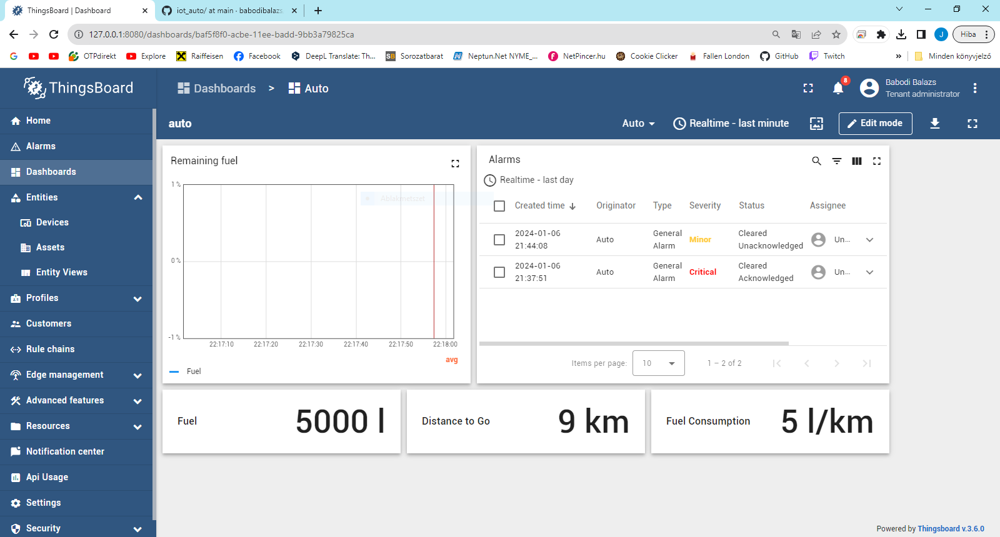

# Creating a Car in Thingsboard

The python code sends the current fuel, the maximum fuel, the fuel consumption rate and distance we need to travel (if we are traveling) over to Thingsboard.

After running the code, we have 3 options:

- Go somewhere
- Fuel up
- Check fuel

After we choose to go somewhere we, (Go somewhere) changes to (Keep going), and we also get the option to (Stop).

## The Dashboard

On the Dashboard, we can see how much fuel we have left in both numbers, or in the percantage of total left, how far we still have to go, and our fuel consumption rate, along with any errors we get.

## How to Run

- Install Thingsboard [On Premise](https://thingsboard.io/docs/user-guide/install/windows/) or [using Docker](https://thingsboard.io/docs/user-guide/install/docker-windows/), or use the [Demo version online](https://demo.thingsboard.io/).
- Create a device in your Thingsboard.
- In the python code, change the THINGSBOARD_HOST and the DEVICE_ACCESS_TOKEN constants.
- Create the alarm and the dashboard in thingsboard or import the .json files.
- Install the python dependencies then run the python code in your terminal:

`pip install paho-mqtt`

`python coffee_machine.py`

## The Alarms

There are 3 alarams that feed into eachother in the following way:

These will raise an alarm of increasing severity the lower our fuel gets.
